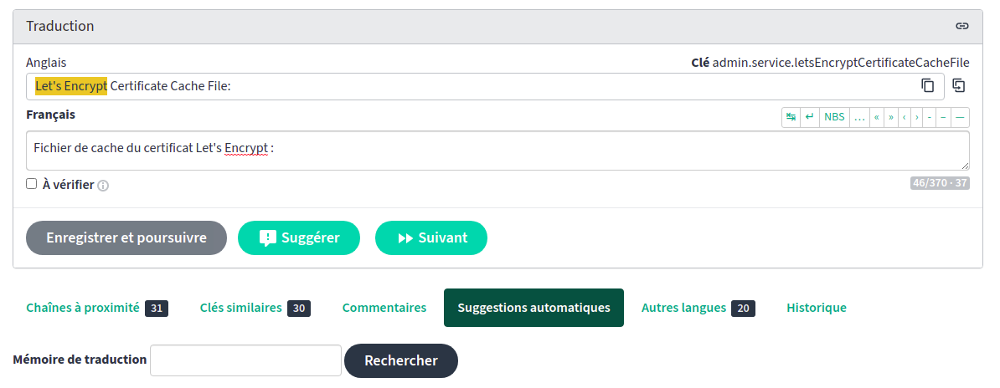

# Règles pour la traduction francophone de Mattermost

<!-- vim-markdown-toc GFM -->

* [Introduction](#introduction)
* [Commentaires pour les traducteurs](#commentaires-pour-les-traducteurs)
* [Traduction hors ligne](#traduction-hors-ligne)
* [Insertion de caractères unicodes](#insertion-de-caractères-unicodes)
    * [Introduction](#introduction-1)
    * [Touche compose](#touche-compose)
    * [Table de caractères](#table-de-caractères)
    * [Code des caractères](#code-des-caractères)
* [Points à améliorer](#points-à-améliorer)
* [Style](#style)
    * [Jargon](#jargon)
    * [Usage de l'impératif](#usage-de-limpératif)
    * [Usage du futur simple](#usage-du-futur-simple)
    * [Majuscules](#majuscules)
    * [Abbréviations](#abbréviations)
    * [Guillemets](#guillemets)
    * [Pluriel de majesté (We couldn't...)](#pluriel-de-majesté-we-couldnt)
    * [Ecriture inclusive](#ecriture-inclusive)
    * [Traduction trop longue](#traduction-trop-longue)
    * [Gestion du pluriel](#gestion-du-pluriel)
        * [Exemple 1](#exemple-1)
        * [Exemple 2](#exemple-2)
        * [Exemple 3](#exemple-3)
        * [Exemple 4](#exemple-4)
* [Outils pour le traducteur](#outils-pour-le-traducteur)
* [Vocabulaire](#vocabulaire)
    * [At rest / in transit](#at-rest--in-transit)
    * [API](#api)
    * [Attach](#attach)
    * [Autocompletion](#autocompletion)
    * [Batch](#batch)
    * [Before taking effect](#before-taking-effect)
    * [BG](#bg)
    * [Bot](#bot)
    * [Constraints](#constraints)
    * [Direct](#direct)
    * [Directory](#directory)
    * [Details](#details)
    * [Documentation](#documentation)
    * [Enter / specify / input field](#enter--specify--input-field)
    * [Email](#email)
    * [Emoji](#emoji)
    * [Encountered](#encountered)
    * [Endpoint](#endpoint)
    * [FileInfos](#fileinfos)
    * [Flag](#flag)
    * [Folder](#folder)
    * [Follow up](#follow-up)
    * [Get / retrieve](#get--retrieve)
    * [Handle](#handle)
    * [Hours / timezone](#hours--timezone)
    * [Jobs](#jobs)
    * [Kick / ban / remove](#kick--ban--remove)
    * [Link/linking](#linklinking)
    * [Marshalling](#marshalling)
    * [Member / channel member](#member--channel-member)
    * [Message](#message)
    * [Message export job](#message-export-job)
    * [Modify](#modify)
    * [Mute](#mute)
    * [Notifications push / mobile / desktop](#notifications-push--mobile--desktop)
    * [Optional](#optional)
    * [Override](#override)
    * [Packaged](#packaged)
    * [Parse / parser](#parse--parser)
    * [Permanently](#permanently)
    * [Permissions](#permissions)
    * [Populate](#populate)
    * [Posted / posts / publication](#posted--posts--publication)
    * [Private message](#private-message)
    * [Preview mode](#preview-mode)
    * [Preview features](#preview-features)
    * [Privacy](#privacy)
    * [Purpose](#purpose)
    * [Rate limits](#rate-limits)
    * [Reactions](#reactions)
    * [Refresh](#refresh)
    * [Retrieve](#retrieve)
    * [Rollback](#rollback)
    * [Routes](#routes)
    * [Save](#save)
    * [Scheme](#scheme)
    * [Slash commands](#slash-commands)
    * [SSO](#sso)
    * [Terms](#terms)
    * [Token / secret key](#token--secret-key)
    * [Trigger](#trigger)
    * [Unread](#unread)
    * [URL signing](#url-signing)
    * [Worker](#worker)

<!-- vim-markdown-toc -->

## Introduction

Bonjour et merci de participer à la traduction francophone de Mattermost !

Mattermost utilise [une instance Pootle pour ses traductions](http://translate.mattermost.com/fr/). Si ce n'est pas déjà fait, veuillez créer un compte sur cette instance pour pouvoir participer.

Veuillez noter que cette instance est habituellement indisponible tous les jours de minuit à une heure du matin (UTC+1). L'instance doit en effet être coupée lorsque les traductions sont en cours de synchronisation avec le repository git de Mattermost.

De même, il est vivement recommandé d'[utiliser une version de développement de Mattermost](https://docs.mattermost.com/developer/developer-setup.html) de façon à pouvoir vous [assurer que vos traductions soient correctes selon le contexte](https://docs.mattermost.com/developer/localization-process.html#test-translations).

Enfin, veuillez prendre la peine de lire ces quelques règles de traduction à respecter.

Le nombre de chaînes à traduire étant assez élevé au sein du projet Mattermost, si vous trouvez des traductions qui ne respectent pas ces quelques règles, merci de proposer une correction dans l'[interface Pootle de traduction](http://translate.mattermost.com/fr/).

Si vous ne trouvez pas comment traduire un terme, regardez comment le même terme a été traduit les fois précédentes, regardez sur le [glossaire de Traduc.org (organisation de volontaires de traducteurs francophones pour logiciels libres)](https://glossaire.traduc.org), ou posez votre question sur [le canal Mattermost de traduction francophone](https://pre-release.mattermost.com/core/channels/french-localization).

## Commentaires pour les traducteurs

Pootle supporte l'ajout de commentaires permettant d'aider le traducteur. Ils sont utiles pour préciser à l'utilisateur si une chaîne doit se traduire à l'infinitif ou à l'impératif par exemple. En effet, en anglais il n'y a aucune différence entre ces deux formes, seul le contexte et la cohérence du reste de la boite de dialogue nous permettent de choisir un temps plutôt qu'un autre.

Ces commentaires peuvent être ajoutés par le biais de Pootle ou par le biais de tout autre logiciel supportant les fichiers .po (gettext). Ils sont en effet sauvegardés au sein du fichier.

Cependant, veuillez garder à l'esprit que ces commentaires doivent être courts.

**Veuillez ne pas placer de retours à la ligne** insérés par `CTRL+ENTREE` dans ces commentaires. Le caractère produit `^M` (ou `0d` -zero d- en hexadecimal) n'est pas reconnu par `po2i18n` lorsqu'il est placé en début de ligne de commentaire. `po2i18n` fait partie de [Mattermosti18n](https://github.com/rodcorsi/mattermosti18n), une suite d'utilitaires écrits en Go, utilisés par Mattermost pour convertir les fichiers .po en fichiers JSON et inversément. Ces retours à la ligne créent également des problèmes avec l'instance Pootle utilisée par Mattermost. Une fois des commentaires avec des retours à la ligne ajoutés, même si ces commentaires sont supprimés par après, [ils sont toujours conservés dans les fichiers .po](https://pre-release.mattermost.com/core/pl/xw9j5r1uij8hxn8j35ippztxsh). Le responsable de Mattermost doit alors modifier le fichier manuellement. Nous ne savons pas quelle pourrait être la cause de ce problème; nous ne parvenons pas à reproduire le problème sur une installation fraîche de Pootle utilisée localement.

## Traduction hors ligne

Bien que l'instance Pootle utilisée par Mattermost offre la possibilité de télécharger les fichiers .po afin de les tester sur une instance de test de Mattermost, le responsable technique de Mattermost [a désactivé manuellement sur Pootle](https://pre-release.mattermost.com/core/pl/9x5msk5iuifuxfm8wyjadsdyec) la possibilité d'envoyer et remplacer les traductions par nos propres fichiers .po pour les raisons suivantes.

* Toutes les chaînes sont marquées comme `traduites` après que le fichier ait été envoyé, même si des chaînes n'ont pas été traduites;
* Les traductions peuvent être périmées entre le moment auquel le contributeur télécharge son fichier et renvoie le fichier sur Pootle;
* Renvoyer les fichiers sur la plateforme écrase la version précédente; dans le cas d'un problème, comme celui évoqué au point précédent avec les commentaires qui peuvent corrompre le build process, il faut qu'un développeur puisse restaurer le fichier dans le cas où il se rend compte que la convertion .po -> JSON échoue. Mattermost ne peut pas garantir qu'un développeur dispose du temps nécessaire pour affectuer cette action.

C'est pourquoi, même si ces raisons sont discutables lorsqu'un contributeur agit en âme et conscience, la seule façon de traduire Mattermost, c'est en ligne par le biais de l'instance Pootle mise à disposition. Les traductions hors lignes ne sont pas possibles.

## Insertion de caractères unicodes

### Introduction

Cette section est utile pour savoir comment insérer un caractère tel que les guillemets français ou l'espace fine insécable, deux caractères nécessaires à la traduction francophone de Mattermost.

Pour savoir comment insérer un caractère unicode, la meilleure façon est de taper son caractère unicode ou d'utiliser la touche compose. Pour ce faire, veuillez vous référer à [la page Wikipedia en question (en englais)](https://en.wikipedia.org/wiki/Unicode_input#Hexadecimal_code_input). En fonction des systèmes d'exploitation, des bibliothèques logicielles et des composants d'entrée système (Wayland/Xorg), la méthode diffère.

Il en est de même en fonction de votre navigateur web. Si vous utilisez Firefox ou Chrome/Chromium sous Linux, étant donné que ces logiciels sont basés sur GTK, outre la touche compose, vous pouvez utiliser la combinaison offerte par GTK `Ctrl+Maj` suivi de `u` et du code hexadécimal (ex.: `202f` pour l'espace fine insécable).

### Touche compose

Comme expliqué dans l'article Wikipedia, les utilisateurs de KDE ou de programmes écrits à l'aide de la bibliothèque Qt ne peuvent qu'utiliser la touche compose. Cette derière peut être liée à une touche de clavier que vous pouvez spécifier parmi une liste de touches prédéfinies. Ce lien s'effectue dans les paramètres sytèmes de KDE Plasma: `System Settings` > `Input Devices` > `Keyboard` > `Advanced` > `Position of Compose key` ([src.](https://unix.stackexchange.com/a/222791/146454#comment378580_222791)). La touche `Ctrl` de droite est un bon choix. Si vous spécifiez `Alt`, vous allez rentrer en conflict avec la touche `AltGr` utilisée pour placer le dièse par exemple ou tout autre caractère accessible par le 3ième niveau de touche sur les clavier francophones (Azerty belge et Azerty français).

Sous Windows, il vous est également possible d'utiliser le logiciel [WinCompose](https://github.com/samhocevar/wincompose). L'espace fine insécable n'est pas supporté par défaut. Pour le supporter, ajoutez simplement un fichier dans `%USERPROFILE%\.XCompose` avec la ligne suivante:

    <Multi_key> <space> <space> <space>		: " "	U202f		# NARROW NO-BREAK SPACE

[Un patch a été fourni pour xcompose -un projet utilisé par WinCompose-](https://github.com/kragen/xcompose/pull/33) pour supporter ce caractère.

Une fois le logiciel WinCompose relancé, il vous suffira de taper sur la touche Compose (par défaut `Alt` droit, ce paramètre peut être changé dans les options de WinCompose) suivie de trois fois la touche `espace`.

Sous Linux, le principe est le même, placez dans votre `$HOME` un fichier `.XCompose` et relancez Xorg (ou redémarrez simplement votre machine).

### Table de caractères

Il est également possible de copier-coller le caractère de votre choix en utilisant l'[insertion de caractères spéciaux dans LibreOffice Writer](https://help.libreoffice.org/Common/Special_Character/fr) ou d'utiliser le logiciel de table de caractère propre à votre OS.

* Sous Windows, ouvrez `charmap.exe`, cochez la case `Advanced view`, tappez le caractère que vous souhaitez en toutes lettres en anglais, cliquez sur `Search`, sélectionnez le caractère dans la table de résultats et cliquez sur `Copy`.

 

* En utilisant l'application KDE `kcharselect`, le principe est similaire:

 

### Code des caractères

Espace fine insécable (` `):

* Avec la touche compose configurée précédemment: `compose+space+space+space`.

Guillemets ouvrants (`« `):

* Avec la touche compose configurée précédemment: `compose+<+<` suivi d'une espace fine insécable `compose+space+space+space`.
* Sans la touche compose: lire [article wikipedia pour les guillemets](https://en.wikipedia.org/wiki/Guillemet#Typing_.22.C2.AB.22_and_.22.C2.BB.22_on_computers) et [article wikipedia pour les espace fines insécables](https://en.wikipedia.org/wiki/Non-breaking_space#Keyboard_entry_methods)

Guillemets fermants (` »`):

* similaire aux guillemets ouvrants, en inversant le sens et les `<` par `>`.

## Points à améliorer

La traduction francophone est déjà dans un très bon état. Parmi les points à améliorer pour les prochaines versions :

* Utiliser l'espace fine insécable plutôt que l'espace insécable est recommandé selon les règles typographiques francophones. Le caractère représentant l'espace fine insécable est disponible depuis la sortie de Unicode 3.0 et est bien supporté par les logiciels (cf. [le rapport sur l'utilisation de l'espace fine insécable au sein des logiciels libres](http://malizor.org/public/fines/fines.pdf)). L'espace insécable est, quant à lui, dans le monde du web et du domaine des zones de texte, souvent source d'erreurs (cf. [bug chromium](https://bugs.chromium.org/p/chromium/issues/detail?id=346096)) .
* Remplacer les guillemets américains par leur version francophone.

## Style

### Jargon

Mattermost dispose de son propre jargon. Pour en prendre connaissance, lisez la section [Message](#message).

### Usage de l'impératif

| EN | FR |
| --- | --- |
| Enter your credentials | **Veuillez** saisir vos informations d'identification |

De façon à assouplir l'ordre, nous employons `vouloir` à l'impératif avant le verbe représentant l'action à effectuer; sans utiliser de mention `s'il vous plait`.

### Usage du futur simple

| EN | FR |
| --- | --- |
| When true, the OAuth 2.0 application is considered trusted by the Mattermost server | Lorsqu'activé, l'application OAuth 2.0 est considérée comme étant de confiance par le serveur | 
| The URL for the About link on the Mattermost login and sign-up pages. If this field is empty, the About link is hidden from users. | L'URL vers la page À propos apparaissant sur les pages de connexion et d'enregistrement de Mattermost. Si ce champ est laissé vide, le lien sera masqué pour les utilisateurs. |
| Slack Import: Channel {{.ChannelName}} header exceeds the maximum length. It will be truncated when imported. | Importateur Slack : L'entête du canal {{.ChannelName}} excède la longueur maximale. Il sera tronqué lors de l'importation. |
| (Optional) The attribute in the AD/LDAP server that will be used to populate the first name of users in Mattermost. When set, users will not be able to edit their first name, since it is synchronized with the LDAP server. When left blank, users can set their own first name in Account Settings. | (Optionnel) L'attribut dans le serveur AD/LDAP qui est utilisé pour les prénoms des utilisateurs de Mattermost. Lorsque défini, les utilisateurs ne peuvent pas éditer leur prénom étant donné qu'il est alors synchronisé avec le serveur LDAP. Lorsque laissé vide, les utilisateurs peuvent définir leur propre prénom dans les paramètres du compte. |

Ne vous calquez pas sur le temps utilisé dans la version anglaise. [Selon une petite étude menée avec des francophones natifs](https://irc.died.re/2017/08/12/#line-536), utiliser l'indicatif futur simple donne l’impression d’une fonctionnalité documentée mais pas encore implémentée.

L'indicatif présent (ici à la voix passive) sonne plus naturellement et semble moins étrange. L'important est ici encore de garder une certaine cohérence. Notre traduction utilise le plus possible de l'indicatif présent; utiliser un temps passé ou futur est, la plupart du temps, à proscrire.

Dans tous les cas, veuillez conserver une concordance des temps correcte. [Pour rappel](https://www.francaisfacile.com/exercices/exercice-francais-2/exercice-francais-15267.php):

* si + présent -> futur simple (ou présent)

  `Si tu veux, je viendrai / je viens.` (selon le contexte)

* si + imparfait -> conditionnel présent

  `Si tu voulais, tu pourrais.`

* si + plus-que-parfait -> conditionnel passé

  `Si tu avais voulu, tu aurais pu.`

### Majuscules

| EN | FR |
| --- | --- |
| System Console |Console **s**ystème |
| Private Messages | Messages **p**rivés |
| Please configure your {docsLink} in the System Console or in gitlab.rb if you're using GitLab Mattermost. | Veuillez configurer votre {docsLink} dans la console système ou dans le fichier gitlab.rb si vous utilisez GitLab Mattermost. |

Les anglophones apprécient placer des majuscules dans des mots qu'ils considèrent composés. En français, nous n'utilisons pas de majuscules.

De même, en plein milieu d'une phrase de description de fonctionnalité, comme `Aller dans la console système`, nous ne plaçons pas de majuscules. Nous en plaçons uniquement lorsque nous spécifions les menus (ex.: `Paramètres du compte` > `Options avancées` > `...`).

### Abbréviations

Exemple s'abrège en `ex. :`. Notez l'utilisation d'une espace après le point. Vous devriez utiliser une espace fine insécable pour cette espace (cf. [Insertion de caractères unicodes](#insertion-de-caractères-unicodes)).

### Guillemets

Utilisez les guillemets francophones (cf. [Insertion de caractères unicodes](#insertion-de-caractères-unicodes)).

### Pluriel de majesté (We couldn't...)

Il s'avère quelques fois que les messages de Mattermost s'expriment en `nous` plutôt qu'en `il`, par exemple: `We couldn't check the permissions`. Une traduction telle que `Nous ne pouvons pas vérifier les permissions` est tout à fait incorrecte.

De façon à se calquer au plus près des autres traductions, pareil texte sera traduit par `Impossible de vérifier les permissions` plutôt que `Les permissions n'ont pas pu être vérifiées`.

### Ecriture inclusive

| EN | FR |
| --- | --- |
| @{{.Username}} was mentioned, but they did not receive notifications because they do not belong to this channel. | @{{.Username}} a été mentionné(e), mais, ne faisant pas partie de ce canal, il/elle ne recevra pas de notification. |

Nous n'utilisons pas l'écriture inclusive, celle utilisant le '·', car en plus de ne pas avoir été validée par l'Académie française, elle rend le texte plus difficile à comprendre. Nous pensons qu'il s'agit surtout d'une solution temporaire, surfant sur la vague du féminisme français. Toutefois, lorsque rendu nécessaire comme dans le texte ci-dessus, nous privilégions plutôt les parenthèses ou la mention explicite il/elle, qui sont des emplois beaucoup plus répandus en francophonie. Par facilité de lecture, nous nous refusons à ajouter des contreparties féminines à tous les termes masculins; par conséquent nous considérons toujours la règle « le masculin l'emporte » comme étant valable au sein de cet effort de traduction/régionalisation.

### Traduction trop longue

Si votre traduction s'avère être trop longue pour l'espace octroyé par l'interface utilisateur et si, compte tenu du sens, vous n'êtes pas en mesure d'abréger la traduction francophone, veuillez exposer le problème sur le [canal "Localization" de Mattermost](https://pre-release.mattermost.com/core/channels/localization).

### Gestion du pluriel

Au sein de Mattermost, les règles de pluralisation en fonction de la langue sont gérées par la bibliothèque formatjs. Il se peut que vous rencontriez la syntaxe de cette bibliothèque au gré de vos traductions. La syntaxe de formatjs se matérialise comme tel:

    {key, plural, matches}

* `key`: il s'agit de la variable qui représente le nombre d'éléments
* `plural`: il s'agit d'un mot clé fixe (en l'occurrence `plural`) qui indique que le mapping concerne un appel à la bibliothèque formatjs.
* `matches`: il s'agit de la syntaxe propre à formatjs qui va s'occuper de déterminer si la proposition va concerner le singulier, ou le pluriel, voire un nombre particulier (0, 1, 2, etc.).

En place de `matches` peuvent donc se trouver un ou plusieurs des mots clés suivants:

* `zero`: Cette catégorie est utilisée pour les langues qui ont une grammaire spécifique lorsqu'il n'y a aucun élément, comme l'arabe ou le letton. Le français n'étant pas directement concerné par cet élément, on pourra utiliser celui relatif au singulier en lieu et place de cette catégorie.
* `one`: Cette catégorie est utilisée pour les langues qui ont une grammaire spécifique pour un seul élément, ce qui concerne de nombreuses langues. De nombreuses langues asiatiques, comme le chinois ou le japonais, n'utilisent PAS cette catégorie. Le français est conserné par cette grammaire. On utilisera donc ce mot clé, souvent en combinaison de `other`, cf. plus bas.
* `two`: Cette catégorie est utilisée pour les langues qui ont une grammaire spécifique pour deux éléments, comme l'arabe ou le gallois. Le français est également concerné, bien que `other` puisse être utilisé en lieu et place.
* `few`: Cette catégorie est utilisée pour les langues qui ont une grammaire spécifique pour quelques éléments. Certaines langues ont des règles pour 2-4 éléments, d'autres pour 3-10, et d'autres disposent de règles encore plus complexes. Le français n'est pas concerné par cette règle.
* `many`: Cette catégorie est utilisée pour les langues qui ont une grammaire spécifique pour beaucoup d'éléments comme l'arabe, le polonais ou le russe.
* `other`: Cette catégorie est utilisée si aucune value ne correspond à l'une des catégories précédentes. Cette catégorie est souvent utilisée comme la forme pluriel pour certaines langues comme le français ou l'anglais qui ont une grammaire distincte seulement pour les éléments singuliers et ceux pluriel.
* `=value`: Cette catégorie est utilisée pour faire correspondre à une certaine valeur peu importe la catégorie de pluriel utilisée plus haut.

Pour illustrer le [fonctionnement de cette bibliothèque](https://formatjs.io/guides/message-syntax/#plural-format), prenons les exemples suivants.

#### Exemple 1

    New {count, plural, one {message} other {messages}}

donne au sein de l'interface `New message` au singulier et `New messages` pour le pluriel.

En français, 2 versions de traduction sont nécessaires également. Une pour le singulier (`Nouveau message`) et l'autre pour le pluriel (`Nouveaux messages`).

Dans le syntaxe de formatjs, ceci donne la déclaration suivante :

    {count, plural, one {Nouveau message} other {Nouveaux messages}}

#### Exemple 2

    {count, number} {count, plural, one {user} other {users}} of {total, number} total

    {count, number} {count, plural, one {utilisateur} other {utilisateurs}} d'un total de {total, number}

Produira les 2 traductions suivantes: `1 utilisateur d'un total de x` vs `x membres d'un total de x`.

#### Exemple 3

    {count, number} {count, plural, one {Feature} other {Features}} Enabled

    {count, number} {count, plural, one {fonctionnalité activée} other {fonctionnalités activées}}

Comme vous pouvez le voir, selon le contexte, il est possible que vous deviez placer plus de mots dans les accolades de façon à accorder l'ajectif. L'adjectif est en effet invariable en anglais, les chaines anglaises ne tiennent pas compte de ce détail. `1 fonctionnalité activée` vs `x fonctionnalités activées`.

#### Exemple 4

    Every {count, plural, one {minute} other {{count, number} minutes}}

    {count, plural, one {Chaque minute} other {Toutes les {count, number} minutes}}

Ici, il est question d'un changement important, la tournure de phrase ne se traduit pas du tout de la même façon suivant qu'il s'agisse du singulier ou du pluriel: `Chaque minute` vs `Toutes les x minutes`.

## Outils pour le traducteur

[La communauté francophone de KDE](https://fr.l10n.kde.org/pology.php) utilise un outil écrit en python appelé "pology". Cet outil permet d'effectuer toutes sortes d'opérations sur des fichiers po (gettext). Pour en savoir davantage sur les fonctionnalités de pology, [veuillez lire sa documentation](http://pology.nedohodnik.net//doc/user/en_US/index-mono.html).

Installez le paquet correspondant à pology sous votre distribution (sous Arch Linux, utilisez [pology-svn](https://aur.archlinux.org/packages/pology-svn/)) ou clonez le dépôt SVN:

    svn co svn://anonsvn.kde.org/home/kde/trunk/l10n-support/pology

Pour vous assurer que votre traduction dispose d'espaces insécables, ce qui est vivement recommandé en français, téléchargez les fichiers .po de l'instance pootle et exécutez pology de façon à ajouter automatiquement des espaces insécables sur le fichier .po (ATTENTION: exécuter cette commande modifie directement le fichier, pensez donc à le sauvegarder avant) :

    /usr/share/pology/scripts/posieve.py fr:setUbsp ./web_static.po

Les autres commandes de pology telles que `check_rules`, `check_spell`, `check_grammar` et `find_messages` soit n'ont pas été testées, soit ne sont pas compatibles à cause de la façon dont les paramètres des chaînes de Mattermost sont représentés dans le langage Go. La présence de `{{.varName}}`, par exemple, est considérée comme une erreur par pology (un espace est requis après un point, etc.).

## Vocabulaire

### At rest / in transit

| EN | FR |
| --- | --- |
| Invalid at rest encrypt key for SQL settings. Must be 32 chars or more. | Clé de chiffrement invalide pour les paramètres SQL pour les données au repos (les données stockées sur des disques dans ces centres de données sont appelées « au repos », au contraire de « en transit » soit lorsqu'elles sont transférées sur le réseau). Doit être égale ou supérieure à 32 caractères. |

Ce concept est assez récent et a reçu une plus grande notoritété récemment suite à l'entrée en vigueur des nouveaux règlements sur la protection des données personnelles comme le RGPD. 

Dans le cadre du traitement des données, ces dernières se situent toujours dans l'un des états suivants :
* `Data in use` (données en utilisation): les données sont constamment en cours de changement de stockage, passage en centre de données, utilisation dans des feuilles de calcul, etc.
* `Data in motion` ou `Data in transit`: lorsque les données sont en cours de transfert via le réseau informatique ou lorsqu'elle sont transférées en mémoire vive ou simplement mises à jour .
* `Data at rest`: données inactives stockées dans des bases de données, des archives, des sauvegardes, bref toutes les données qui ne sont pas susceptibles d'être directement utilisées. Dans le cas de Mattermost, ceci peut être les vieilles données de chat échangées sur l'application il y a longtemps.

Nous avons décidé de prendre quelques latitudes dans la chaîne traduite de permettre à rajouter des précisions sur ce terme assez nébuleux pour un francophone.

### API

| EN | FR |
| --- | --- |
| Empty array under 'image' in request | Tableau vide dans le paramètre 'image' de la requête |

Bien que « section » aurait pu convenir dans ce contexte, dans le cadre d'une requête sur une API, il est plus question de « paramètre ».

### Attach

| EN | FR |
| --- | --- |
| Error attaching files to post. postId=%v, fileIds=%v, message=%v | Une erreur s'est produite lors du lien des fichiers au message. postId=%v, fileIds=%v, message=%v |
| Unable to attach emoji data to request | Impossible de lier une émoticône à la requête |
| Attaching Files | Joindre des fichiers |
| To import posts with attached files, see {slackAdvancedExporterLink} for details. | Pour importer des messages avec fichiers joints, voir {slackAdvancedExporterLink} pour plus de détails. |

En parlant de pièces jointes (`attachments`) et donc de fichiers, utilisez le terme `joint`/`joindre`.

Dans le cas contraire, utilisez le plus possible la mention de `lien`. En effet, nous utilisons déjà le terme `joindre`/`rejoindre` dans le cas d'un utilisateur joignant/quittant un canal.

### Autocompletion

| EN | FR |
| --- | --- |
| Check with your System Admin or open the autocomplete list by typing `/` to determine if your team configured any custom slash commands. | Demandez à votre administrateur système ou ouvrez la liste de suggestions de commandes en tapant `/` pour savoir si votre équipe a configuré des commandes slash personnalisées. |
| When true, Elasticsearch will be used for all autocompletion queries on users and channels using the latest index. | Lorsqu'activé, Elasticsearch est utilisé pour toutes les requêtes d'auto-complétion sur les utilisateurs et les canaux en utilisant le dernier index disponible. |

Selon le cas, peut également exprimer l'idée de « suggestion » ou de « saisie semi-automatique ».

### Batch

| EN | FR |
| --- | --- |
| Email batching job's receiving channel was full. Please increase the EmailBatchingBufferSize. | Le canal recevant les e-mail envoyés par lot est plein. Veuillez augmenter le paramètre EmailBatchingBufferSize. |

L'envoi par lots.

### Before taking effect

| EN | FR |
| --- | --- |
| Changing properties in this section will require a server restart before taking effect. | Modifier les paramètres de cette section nécessite un redémarrage du serveur avant de prendre effet. |

Simplement traduit de façon littérale. Ne pas utiliser `Pour prendre effet`.

### BG

| EN | FR |
| --- | --- |
| Button BG | Arrière-plan du bouton |

`BG` correspond à `background`. On n'utilise pas `fond` mais bien `arrière-plan`.

### Bot

Utilisez BOT ou Bot en contexte, car ce terme est de plus en plus utilisé en français dans le cadre des solutions de messagerie pour désigner des programmes informatiques qui interragissent comme s'il s'agissait d'une personne au sein du chat.

### Constraints

| EN | FR |
| --- | --- |
| Channel membership denied to the following users because of group constraints: {{ .UserIDs }} | L'ajout en tant que membre au canal a été refusé pour les utilisateurs suivants à cause de restrictions de groupe : {{ .UserIDs }} |
| User cannot be added to this channel because it is constrained to group members only. | L'utilisateur ne peut pas être ajouté à ce canal parce ce canal est uniquement restreint aux membres de ce groupe. |
| Unable to remove a user from a group-constrained team. | Impossible de retirer un utilisateur d'une équipe disposant de restrictions de groupe. |

A traduire de façon similaire à « restrictions » en termes de droits d'accès.

### Direct

[cf. Message](#message)

### Directory

On utilise le terme dossier au sein de la traduction, excepté pour AD/LDAP ou Active Directory qui restent, eux, sans traduction vu qu'il s'agit du nom d'un produit.

### Details

| EN | FR |
| --- | --- |
| Please ask your system administrator for more details | Veuillez demander à votre administrateur système pour en savoir plus |

N'utiliser pas `pour plus de détails`, `pour plus d'information` (ni sa variante au pluriel).

### Documentation

Dans ce contexte, on utilise le terme `Consultez la documentation pour en savoir plus.`. On n'utilise pas la tournure de phrase `pour en savoir davantage`, c'est trop long. Il en est de même pour `Veuillez vous référer` qui est également trop long.

Lorsque des mentions comme `our documentation` sont employées, il est important de les traduire par `notre documentation` et non par `la documentation`. En effet, on rencontre pareilles mentions dans le cas de ElasticSearch. Dans ce contexte, il s'agit de la documentation ElasticSearch propre (et donc spécifique) à Mattermost; il ne faudrait pas que l'utilisateur se rende sur la documentation générique de ElasticSearch qui ne l'aidera pas dans ce cas de figure.

### Enter / specify / input field

| EN | FR |
| --- | --- |
| Please enter your email | Veuillez **spécifier** votre adresse e-mail |
| Please enter an email address | Veuillez **spécifier** une adresse e-mail |
| SHIFT+DOWN (in input field): Highlight text to the next line\n | MAJ+BAS (dans le champ de saisie) : Sélectionne le texte jusqu'à la ligne suivante\n |
| Delete a message by clicking the **[...]** icon next to any message text that you’ve composed | Supprimez un message en cliquant sur l'icône **[...]** située à côté de chaque message que vous avez composé | 

Par mesure de cohérence, la règle générale est d'utiliser le terme `spécifier`. `saisir` est uniquement employé pour qualifier la `zone de saisie`.

Pour ce qui est des messages qui ne spécifient pas une option : une publication, un message de texte, on utilisera le terme `composer` ([cf. Message](#message)).

### Email

| EN | FR |
| --- | --- |
| Unable to find status of recipient for batched email notification | Impossible de trouver le statut du destinataire pour l'envoi par lot des notifications par e-mail |

Utilisez `adresse e-mail` et non `adresse électronique`. `Adresse électronique` n'a jamais vraiment été utilisé en dehors de la France et tend à être rendu nébuleux à cause des protocoles récents tels que le Bitcoin ou la Blockchain qui, eux, utilisent une adresse que l'on qualifie d'électronique.

### Emoji

`émoticône` est à privilégier dans la traduction de Mattermost.

### Encountered

| EN | FR |
| --- | --- |
| An error encountered | Une erreur s'est produite |

`est survenue` aurait pu être correct également, mais `s'est produite` est à privilégier pour des raisons de cohérence.

### Endpoint

[cf. section relatives aux APIs et aux routes d'API](#Routes)

### FileInfos

A l'instar de [`NotifyProps`, cf. plus bas](#Notifications push / mobile / desktop), il s'agit du nom d'un objet et doit être traduit en fonction du contexte. Si le message est lié à l'API par exemple, on laissera le terme `FileInfos`; dans le cas où le message est destiné à l'utilisateur final, on traduira par `informations du fichier`.

### Flag

| EN | FR |
| --- | --- |
| Flagged Posts | Publications marquées d'un indicateur |
| Flag | Marquer avec un indicateur |
| Flag | Ajouter un indicateur |
| Flag | Marquer |
| Unflag | Supprimer l'indicateur |

Remarquons que plusieurs traductions pour `flag` ont été utilisées ci-dessus. Choisissez simplement celle qui convient en fonction de la taille disponible.

Attention, le mot `flag` est également utilisé pour les catégories d'émoticônes (cf. `.mobile.emoji_picker.flags`). Dans ce cas de figure et uniquement dans celui-ci, utilisez le terme `Drapeaux`.

### Folder

[cf. Directory](#directory)

### Follow up

| EN | FR |
| --- | --- |
| Follow up flag | Indicateur de suivi |

Il s'agit simplement des indicateurs pour suivre un message. 

### Get / retrieve

| EN | FR |
| --- | --- |
| We couldn't get the team members | Impossible de récupérer les membres de l'équipe |
| Error to retrieve the current channel. | Impossible de récupérer le canal courant. |

`récupérer` est à privilégier pour des raisons de cohérence.

### Handle

| EN | FR |
| --- | --- |
| A channel with that handle already exists | Un canal avec ce pseudonyme existe déjà |
| This field is handled through your login provider. If you want to change it, you need to do so through your login provider. | Ce champ est géré par le service d'authentification. Si vous souhaitez le modifier, vous devez le faire par le biais de votre service d'authentification. |

Veuillez ne pas utiliser pseudonyme dans ce contexte. Identifiant est suffisant.

### Hours / timezone

| EN | FR |
| --- | --- |
| {{.SenderName}} - {{.Hour}}:{{.Minute}} {{.TimeZone}}, {{.Month}} {{.Day}} | {{.SenderName}} - {{.Day}}/{{.Month}}, {{.Hour}}:{{.Minute}} {{.Timezone}} |

Le travail de traduction n'implique pas seulement une traduction bête et méchante des chaînes de caractères. Ces dernières doivent également être adaptée en fonction de la coutume ou des habitudes. Dans la francophonie, l'ordre des éléments d'une date n'est pas le même qu'en anglais. Il s'agit là tout d'un travail de localisation.

Ici, en l'occurrence, on placera la date avant l'heure et les éléments de la chaîne de la data seront séparés par un slash (`/`).

### Jobs

| EN | FR |
| --- | --- |
| No indexing jobs queued. | Aucune tâche d'indexation mise en file d'attente. |

Le terme `tâche` est à employer dans le jargon (cf. les `tâches planifiées` sous Windows).

### Kick / ban / remove

| EN | FR |
| --- | --- |
| Remove a member from the channel | Éjecte un membre du canal |
| Failed to add user to channel because they have been removed from the team. | Impossible d'ajouter l'utilisateur au canal car il a été retiré de l'équipe.|
| Failed to find user to be removed | Impossible de trouver l'utilisateur à supprimer |
| Unable to remove license file, err=%v | Impossible de supprimer le fichier de licence, err=%v |

* Pour un fichier, on utilise `supprimer`.
* Pour le fait de retirer un utilisateur d'un canal ou d'une équipe, on emploie `retirer`.
* Pour un `ban`/`banissement` on utilisera `bannir` de façon à se rapprocher de l'anglais et éviter les termes comme `exclure`.
* Pour un `kick`, on emploie `éjecter`.
* Pour le fait de supprimer un utilisateur complètement, on emploie `supprimer`.
* La différence entre un `bannissement` et une `éjection` se traduit par la possibilité pour l'utilisateur de se reconncter par la suite ou non. Pour le banissement, l'utilisateur ne pourra plus se connecter tant que l'administrateur du canal n'aura pas changé d'avis.

### Link/linking

| EN | FR |
| --- | --- |
| Link failed | L'association a échoué |
| Linked | Associé |
| Unlink failed | La dissociation a échoué |

Ces mentions sont souvent rencontrées dans le cadre de la synchronisation d'utilisateurs entre plusieurs plateformes, notamment les annuaires AD/LDAP. Dans ce cadre, nous utiliserons les termes `association` et `dissociation` rencontrées le plus souvent au lieu du terme `lien`. Nous n'avons en effet pas de traduction pour `unlink` ce qui rendait l'ensemble moins harmonieux.

### Marshalling

| EN | FR |
| --- | --- |
| An error occurred marshalling the JSON data for export. | Une erreur s'est produite lors de la préparation à l'exportation (marshalling) des données JSON. |
| marshal error | erreur de transformation de données (marshalling) |

En sciences informatiques, le marshalling (ou marshaling) est le fait de transformer la représentation en mémoire d'un objet dans un format dédié au stockage ou à la transmission réseau. Ce terme est assez proche de la sérialisation. Pour s'adapter à cette définition, nous n'hésitons pas à prendre des latitudes dans la traduction de façon à ce que les non anglophones ou ceux qui n'ont pas des connaissances informatiques poussées puissent tout de même comprendre.

### Member / channel member

| EN | FR |
| --- | --- |
| Could not find channel member when importing direct channel | Impossible de trouver le membre du canal lors de l'importation du canal de messages personnels |
| No channel member found for that user ID and channel ID | Aucun membre de canal trouvé pour cet ID utilisateur et cet ID de canal |

En fonction du contexte et selon la phonétique, il se peut qu'on doive utiliser « de » plutôt que « du ».

### Message

Mattermost est utilisé pour envoyer des `messages`. Ces messages peuvent être composés de texte et/ou d'objets tels que des fichiers (images, documents, émoticônes, etc.).

Au sein de Mattermost, il existe 3 types de canaux et donc 3 types de messages :

* Les messages publics qui sont les messages publiés dans des canaux publics (groupes publics)

* Les messages privés sont les messages publiés dans les canaux privés (groupes privés)

* Les messages personnels qui sont les messages s'adressant en direct à une personne, en un-à-un (one-to-one), ou depuis récemment en petits groupes jusqu'à maximum 5 personnes. Plus communément appelés Messages Directs (ou DM) sur Twitter, ce terme est cependant à proscrire au sein de Mattermost. En effet, sur Twitter la fonctionnalité de DM reprend à la fois les messages par groupes privés et les messages en un-à-un. La fonctionnalité est scindée en 2 fonctionnalités bien distinctes au sein de Mattermost.

Pour chaque type de canal, Mattermost considère 2 types de messages : 

* les publications qui sont les messages parents qui débutent un fil de discussion;

* les réponses qui sont les messages répondant à un message parent (publication) dans un fil de discusion.

Si un utilisateur répond à un message sans passer par la fonctionalité de fil de discusion située dans la barre latérale de droite, son message sera considéré comme une publication et ouvrira un nouveau fil.

On `envoie` un message et on `publie` une publication.

On `compose` un message, une publication ou une réponse.

| EN | FR |
| --- | --- |
| Invalid user ID for direct channel creation | ID utilisateur invalide pour la création du canal de messages privés |
| Failed to create direct channel | Impossible de créer le canal de messages privés |
| Failed to create group channel | Impossible de créer le canal de messages de groupe |
| Missing required direct channel property: members | La propriété requise pour un canal de messages privés est manquante: members |

[cf. Posted / posts / publication](#posted--posts--publication)

### Message export job

| EN | FR |
| --- | --- |
| Message export job BatchSize must be a positive integer | Le paramètre BatchSize de la tâche d'exportation de messages doit être un entier positif |

### Modify

| EN | FR |
| --- | --- |
| Update Email | Modifier l'adresse e-mail |

Bien qu'on ait tendance à vouloir traduire par `mettre à jour`, la plupart du temps traduire par `modifier` est plus simple et correct. On emploiera le terme `mise à jour` uniquement dans le cadre de mises à jour de l'application que nous parlions de la partie serveur ou cliente (webapp, application mobile ou de bureau).

Par exception, on pourra employer le terme `mise à jour` lorsqu'on parlera de raffraichissement de l'affichage d'une vue du logiciel, de la mise à jour d'une connexion WebSocket ou lorsque l'on parle de connexion SMTP/STARTTLS, bien que dans ces derniers cas l'utilisation de `mise à niveau` semble plus appropriée.

### Mute

| EN | FR |
| --- | --- |
| mute | sourdine |
| Could not mute channel {{.Channel}} as you are not a member. | Impossible de mettre en sourdine le cnal {{.Channel}}, car vous n'êtes pas membre de celui-ci. |

### Notifications push / mobile / desktop

| EN | FR |
| --- | --- |
| Desktop notifications | Notifications de bureau |
| Invalid Channel Trigger Notify Prop for user. | La propriété utilisateur de déclencheur de notification de canal est invalide. |
| Invalid Comment Trigger Notify Prop for user. | La propriété utilisateur de déclencheur de notification de commentaire est invalide. |
| Mobile Push | Notifications push sur mobile |
| Encountered error when getting files for notification message, post_id=%v, err=%v | Une erreur s'est produite lors de la récupération des fichiers pour la notification de nouvelle publication, post_id=%v, err=%v |
| Invalid Email Notify Prop value for user. | La valeur de la propriété de notification par e-mail est invalide pour l'utilisateur. |
| Turns off desktop, email and push notifications for the current channel or the [channel] specified. | Désactive les notifications de bureau, par e-mail et push pour le canal actuel ou pour le canal [channel]. |

Traduisez les termes `desktop` et `mobile`. N'employez pas le terme `sur le bureau` ou `sur le mobile`.

Faites attention à ce que votre traduction soit claire lorsqu'il est question de `push`, mentionnez la mention `notification` lorsqu'elle est absente et n'utilisez par le terme `poussée`. Gardez à l'esprit que notification push tend à être de plus en plus utilisé, même en francophonie. Un terme moins employé rendra l'application plus difficile à appréhender.

Veillez à placer la mention `notification` en premier lieu, de façon à rester cohérent avec les termes tels que `notifications push` et `notifications mobiles`. Il s'agit donc bien d'une `notification par e-mail` et non d'un `e-mail de notification`.

Considérez les termes `NotifyProps` et `Notify Props` comme semblables. Ils doivent être traduits. `notify_props` quant à lui est un champ JSON, conservez le tel quel.

### Optional

Par mesure de cohérence, il est recommandé d'utilisé `Facultatif` au lieu du terme `Optionnel`.

### Override

| EN | FR |
| --- | --- |
| Enable integrations to override usernames | Permettre aux intégrations de redéfinir les noms d'utilisateur |

### Packaged

| EN | FR |
| --- | --- |
| Cannot install prepackaged plugin | Impossible d'installer le plugin préempaqueté |

Rappel: il n'y a pas de trait d'union avec le préfixe `pré`.

### Parse / parser

| EN | FR |
| --- | --- |
| Elasticsearch indexing worker failed to parse the start time | Le système d’agrégation Elasticsearch n'a pas pu interpréter l'heure de début |
| Could not parse multipart form | Impossible d'interpréter le formulaire multipart. |

Ne pas traduire par `analyser`, même si ce terme le plus fréquent représente l'analyse de la syntaxe grammaticale d'un langage, `interpréter` dans le sens comprendre est plus correct dans ce cas d'utilisation.

### Permanently

Utilisez `définitivement` à la place de `de façon permanente`.

### Permissions

| EN | FR |
| --- | --- |
| You do not have the appropriate permissions | Vous n'avez pas les permissions requises |
| Invalid permissions to regenerate the OAuth2 App Secret | Permissions insuffisantes pour regénérer la clé secrète de l'application OAuth2 |
| Inappropriate channel permissions | Permissions insuffisantes pour ce canal |

`permissions` est à privilégier pour des raisons de cohérence et de rapprochement avec la version anglaise. `Permissions invalides`, `permissions` et `droits` sont à proscrire.

Dans le cas du contexte de permissions qui nous concerne, il est question de permissions qui sont trop restrictives et non de permissions d'accès invalides (permissions UNIX 775 au lieu de 770 par exemple).

### Populate

| EN | FR |
| --- | --- |
| (Optional) The attribute in the AD/LDAP server used to populate the first name of users in Mattermost. When set, users cannot edit their first name, since it is synchronized with the LDAP server. When left blank, users can set their first name in Account Settings. | (Facultatif) L'attribut du serveur AD/LDAP qui est utilisé pour remplir les prénoms des utilisateurs de Mattermost. Lorsque défini, les utilisateurs ne peuvent pas éditer leur prénom étant donné qu'il est alors synchronisé avec le serveur LDAP. Lorsque laissé vide, les utilisateurs peuvent définir leur propre prénom dans les paramètres du compte. |

### Posted / posts / publication

| EN | FR |
| --- | --- |
| Unable to create /echo post, err=%v | Impossible de créer le message avec la commande /echo, err=%v |
| We couldn't find the pinned posts | Impossible de récupérer les messages épinglés |
| Failed to post update channel header message | Impossible de publier le message indiquant le changement de l'entête du canal |
| Go to Post | Aller au message |

Un `post` ou `poste` est un anglicisme. La règle générale est de garder la mention `message` et le verbe `envoyer` plutôt que `publier` ([cf. Message](#message)).

Dans de très rares cas, comme lorsqu'on veut explicitement identifier le premier message d'un fil de discusion ou lorsque l'on parle d'un message publié par une intégration (un service tiers lié à Mattermost), le terme `publication` est à privilégier. De même, lorsque l'on qualifie globalement les messages d'un canal, on emploiera le terme 'les messages publiés dans le canal X' par exemple.

Notez que pour `Go to Post`, étant donné que ce texte concerne tous types de messages, il n'est pas visible uniquement pour les publications, mais pour tous les messages. Faites donc attention et veuillez à vous documenter lorsque vous tentez de traduire des parties du logiciel faisant appel à des fonctionnalités que vous ne maîtrisez pas totalement.

Lorsqu'un message est publié par un utilisateur, on dit qu'il est `envoyé`, lorsque le message est publié par le système (message `join`/`leave`/changement d'entête), on dit qu'il est `publié`.

Concernant les messages épinglés, bien que `find` aurait pu être traduit par `trouver`, de façon à assurer une certaine cohérence avec les autres messages d'erreur de ce type, nous employons ici le verbe `récupérer` (cf. [Get / retrieve](#get--retrieve) plus haut).

### Private message

[cf. Message](#message)

### Preview mode

Il s'agit du mode dans lequel se trouve Mattermost lorsque les notifications par e-mail ne sont pas activées et que dés lors, la configuration n'est pas totalement terminée. De façon à ne pas créer de confusion, nous utilisons le terme « Mode de démo ».

### Preview features

Lorsque ce terme ets employé pour parler des fonctionnalités en test, qui ne sont pas encore stables, parfois appelées beta, on emploiera le terme « fonctionnalités expérimentales ».

### Privacy

Par mesure de cohérence surtout après les nouveaux réglements comme le RGPD/GDPR, on traduit par « vie privée ».

### Purpose

`Purpose` est souvent employé pour le message de description du canal `purpose message of the channel` par exemple. Il convient donc de le traduire comme `description` dans ce contexte.

### Rate limits

| EN | FR |
| --- | --- |
| Invalid memory store size for rate limit settings. Must be a positive number | Taille du stockage mémoire invalide pour les paramètres de limite de fréquence. Doit être un entier positif. |
| Unable to initialize rate limiting. | Impossible d'initialiser le taux de limite d'appel sur l'API. |

Souvent employé pour désigner une limite de taux. Dans le contexte de Mattermost, il s'agit d'un taux pour limiter le nombre d'appels sur l'API Mattermost que l'utilisateur peut faire dans un temps donné par exemple.

Bien que rencontré parfois dans les domaines du réseau, ce concept de limite n'est pas facile à exprimer en français. Si vous disposez d'une traduction plus appropriée, merci de nous en faire part.

### Reactions

| EN | FR |
| --- | --- |
| Reaction CreateAt property must be greater than the parent post CreateAt. | La propriété de réponse CreateAt doit être plus grande que la valeur de la propriété CreateAt parente. |
| Missing required Reaction property: create_at. | La propriété requise de réaction est manquante : create_at. |

Au sein de Mattermost, les réactions déterminent les +1 / -1 à des messages. A l'instar d'autres solutions de messagerie comme Facebook Messenger, les réactions peuvent également contenir des émoticônes de la collection standard fournie avec Mattermost voire même des émoticônes personnalisées.

Les réactions ne doivent donc pas être confondues avec les réponses à un message ([cf. Message](#message)).

### Refresh

| EN | FR |
| --- | --- |
| Refresh the app now | Actualiser l'application maintenant |

Le terme « refresh » est souvent employé pour déterminer le fait de rafraichir la page d'un navigateur web. Il arrive toutefois que ce terme soit employé pour demander à l'utilisateur de rafraichir l'application Mattermost. Dans ce sens, cela signifie qu'il faut que l'utilisateur appuie sur un bouton en particulier ou ferme ou relance l'application Mattermost. Dans ce dernier cas, on utilisera la traduction « actualiser » plutôt que « rafraichir ».

### Retrieve

[cf. Get](#get--retrieve)

### Rollback

Dans le contexte des bases de données et des transactions, on utilisera « annuler la transaction ».

### Routes

| EN | FR |
| --- | --- |
| Initializing team API routes | Initialisation des routes de l'API équipe |
| Auth Endpoint: | Noeud d'authentification (auth endpoint) |

Bien que ces messages devraient être principalement être vus par du personnel technique et donc sachant parler anglais, il est toutefois préférable de les traduire.

Il faut voir une API comme un arbre composé de branche et de feuilles. Dans le contexte d'une API, chaque branche est appelée `route`, chaque embranchement (y compris le tout dernier placé en feuille) est appelé un `noeud`. Dans le cas d'une feuille, on appelle souvent ce noeud particulier le `noeud de terminaison` (`endpoint` en anglais). Ici, à cause de l'espace restreint, nous supprimons le terme `de terminaison`. Compte tenu de l'emplacement au sein du logiciel, il est préférable de repréciser le terme anglais original à coté du terme francisé, car ces chaines sont vues majoritairement par du personnel technique et les guides et tutoriels en ligne sont souvent en anglais, avoir le terme en anglais, facilite donc la recherche de correspondance.

Microsoft, dans le cadre de sa plateforme .NET, possède une des rares documentations techniques traduites intégralement en français. Un [article en anglais sur le sujet qui nous préoccupe](https://msdn.microsoft.com/en-us//library/cc668201(v=vs.100).aspx) dispose d'[une correspondance française](https://msdn.microsoft.com/en-us//library/cc668201(v=vs.100).aspx).

On utilise le terme `routage` uniquement dans ce cas-ci :

| EN | FR |
| --- | --- |
| ASP.NET Routing | Routage ASP.NET |

Pour tout le reste, Microsoft utilise au choix : `route` ou `itinéraire`. Dans le cas de Mattermost, de façon à uniformiser les traductions mais également de se rapprocher de la version anglophone, nous utiliserons le terme `route`.

De même, toujours basé sur l'exemple `Initializing team API routes`, nous n'utilisons pas de pluriel pour qualifier le noeud, ni nous n'utilisons de prépositions de lien.

Les propositions suivantes seront donc considérées comme invalides et seront refusées dans Mattermost:

| EN | FR |
| --- | --- |
| Initialisation des routes de l'API d'équipe | Initialisation des routes de l'API des équipes |
| Initialisation des routes des APIs d'équipes | Initialisation des routes des APIs de l'équipe |

### Save

Bien qu'on eusse préféré le terme le plus proche de l'anglais, à savoir « sauvegarder », « enregistrer » reste le terme le plus courant, car popularisé suite à l'usage massif des suites bureautique à la fin des années 2000. De plus, le terme « sauvegarde » fait trop penser à la copie de sauvegarde qu'on réalise dans le cas d'une politique de backup sur disques par exemple. On emploiera donc « enregistrer », « enregistrement » et bouton « Enregistrer ».

### Scheme

Attention à ce terme, il est utilisé à plusieurs endroits pour des significations radicalement différentes.
* L'URI scheme est le protocole utilisé dans une URI comme http://, https://, wss://, ftp://, etc. On emploiera « protocole URI » ou « protocole URL » dans ce contexte.
* Dans le cadre des permissions avancées et droits d'accès, un scheme est un ensemble de règles par défaut pour rejoindre un système, une équipe ou un canal. Dans ce contexte, en plus d'avoir une certaine similitude avec le terme anglophone « scheme », on emploiera « schéma de permissions » (« schémas de permissions » au pluriel). En effet, pour attribuer des règles et droits d'accès dans une organisation, il est souvent nécessaire de faire un plan ou un organigramme, et donc un schéma. « stratégie » sera proscrit ici, même si souvent employé dans les environnements Windows.

| EN | FR |
| --- | --- |
| The custom URL scheme {{.Scheme}} is invalid. Custom URL schemes must start with a letter and contain only letters, numbers, plus (+), period (.), and hyphen (-). | Le protocole URL personnalisé {{.Scheme}} est invalide. Les protocoles URL personnalisés doivent commencer par une lettre et ne peuvent contenir que des lettres, des chiffres, et les caractères plus (+), point (.), et trait d'union (-). |
| The provided role is managed by a Scheme and therefore cannot be applied directly to a Channel Member | Le rôle spécifié est géré par un schéma de permissions et ne peut donc pas être appliqué directement à un membre d'équipe |
| New Team Override Scheme | Nouveau schéma de permissions personnalisé |

Nous n'utilisons pas de constructions de phrase traduisant littéralement le terme « override »; ceci donne des phrases trop compliquées.

### Slash commands

Il s'agit des commandes que vous spécifiez lorsque vous commencez votre message par un slash dans Mattermost. `commandes slash` est à privilégier pour des raisons de cohérence.

### SSO

| EN | FR |
| --- | --- |
| SSO / Single Sign-On | Authentification unique (SSO) |

Dans le jargon technique, le terme SSO tend à prendre le pas sur le terme `Authentification unique`. Dans le cadre de Mattermost, il a donc été choisi de suffixer la traduction française par le terme SSO entre parenthèses de façon à préciser le contexte. En effet, le terme `authentification` pourrait être confondu avec le terme `authentification multi-facteurs` (MFA), autre fonctionnalité présente au sein de Mattermost.

Les traductions telles que `authentification simplifiée` ou `connexion unique` sont à proscrire.

### Terms

| EN | FR |
| --- | --- |
| Please enter text for your Custom Terms of Service. | Veuillez spécifier le texte correspondant aux conditions d'utilisation personnalisées. |

Utilisez le terme `conditions d'utilisation personnalisées`. `conditions personnalisées d'utilisation` semble être moins aisé à comprendre de prime abord. N'utilisez pas le terme `conditions de service` qui est une traduction trop littérale.

### Token / secret key

| EN | FR |
| --- | --- |
| Personal access token added to your account | Un jeton d'accès personnel a été ajouté à votre compte |

* `token`: Utilisez le mot `jeton` à la place.
* `secret key`: `clé secrète` si c'est une clé utilisée dans le sens clé à ne pas divulguer, `clé privée` dans le cas où il est fait mention de clé publique ou s'il est question de chiffrement asymétrique.

### Trigger

| EN | FR |
| --- | --- |
| A trigger word cannot begin with a / | Un mot**-clé** déclencheur ne peut commencer par un / |

### Unread

Ni l'Académie françaine, ni les différents dictionnaires semblent s'accorder sur l'usage du tiret entre « non » et l'adjectif ([src.](https://www.dicollecte.org/thread.php?prj=fr&t=17)).
Ici il est proposé de ne pas placer de tiret et d'utiliser donc « non lu ».

### URL signing

| EN | FR |
| --- | --- |
| Additional options such as the URL signing key. Refer to your image proxy documentation to learn more about what options are supported. | Paramètres additionnels tels que la clé de signature d'URL. Consultez la documentation du proxy d'images pour en savoir plus sur les paramètres supportés. |

L'URL signing est un principe permettant de protéger les fichiers d'un serveur web d'accès non autorisés à l'aide d'une clé parfois spécifiée dans l'URL elle-même ([src.](https://www.limestonenetworks.com/support/knowledge-center/24/112/what_is_url_signing.html)). En pratique nous pouvons traduire par `clé de signature d'URL`.

### Worker

| EN | FR |
| --- | --- |
| Elasticsearch indexing worker failed to parse the end time | Le système d’agrégation Elasticsearch n'a pas pu analyser l'heure de fin |

Bien que le terme doive se traduire par `travailleur`, on enploiera le terme `système de` en fonction du contexte.

